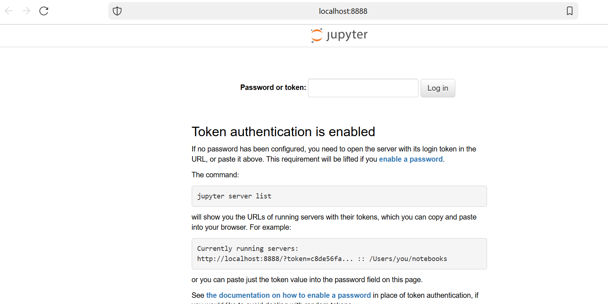
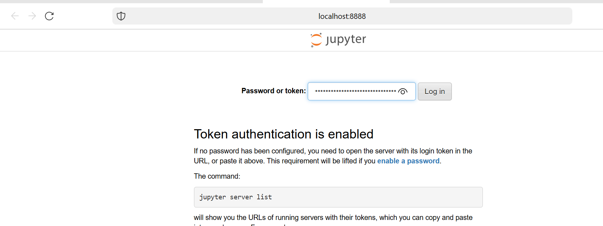

# Enterprise-Style Data Engineering Project

This project is an enterprise-like data engineering environment designed for learning purposes. It includes:
- Spark (Master, Worker, Thrift Server)
- Kafka and Zookeeper for streaming data
- Airflow for orchestration
- Apache Superset for BI and querying
- Jupyter Notebook for interactive development
- Nginx as a reverse proxy
- Prometheus and Grafana for monitoring
- Great Expectations for data quality validations

## Prerequisites
- Docker
- Docker Compose

## Running the Project
1. Clone this repository.
2. Navigate to the project directory.
3. Run the command:
   ```bash
   docker-compose up -d

Access the services via:

Airflow: http://localhost:8081

Superset: http://localhost:8088

Jupyter: http://127.0.0.1:8888/lab

Nginx (reverse proxy): http://localhost

Prometheus: http://localhost:9090

Grafana: http://localhost:3000

open the notebook, run the below command 
docker-compose exec jupyter jupyter notebook list


copy token value and past it "Password or token: " 


